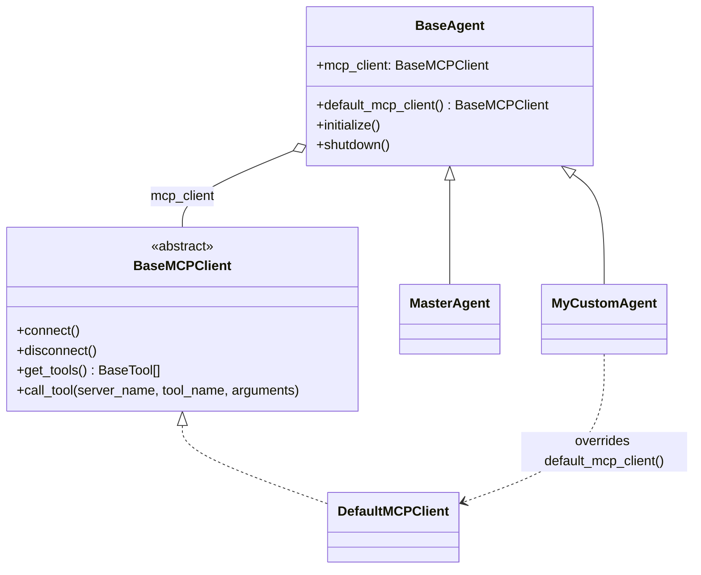
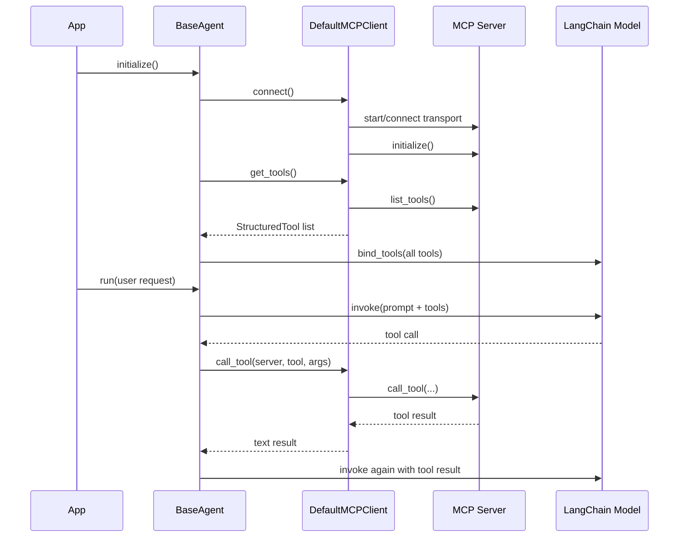

# MCP Client Documentation

This document explains the current implementation in `BasePackage/MCPClient.py`
and how it plugs into `BasePackage/BaseAgent.py`. It is intentionally based only
on what exists in code today.

See also: [BaseAgent.md](BaseAgent.md), [ClassReference.md](ClassReference.md).

## Overview

Every agent built on `BaseAgent` (including `MasterAgent` and
`MasterAgentLanggraph`, which both extend `BaseAgent` via `OrchestratorMixin`)
gets a default, overridable MCP (Model Context Protocol) client for free:

- `BaseMCPClient` — the abstract contract every MCP client implementation must satisfy.
- `DefaultMCPClient` — a ready-to-use implementation backed by the official `mcp` SDK.
- `AgentConfig.mcp_servers` — declarative list of MCP servers an agent should connect to.
- `BaseAgent.default_mcp_client()` — the single override point agents use to swap in custom behavior.

Agents that don't configure `mcp_servers` pay no cost: `default_mcp_client()`
returns `None` and no connection is attempted.

## Why it is written this way

- **Template Method pattern**, matching `default_model()`: `BaseAgent` provides
  a working default, and subclasses override one factory method instead of
  duplicating connection/lifecycle logic.
- **Async MCP sessions behind a sync API**: the `mcp` SDK is async-first
  (`ClientSession`, `stdio_client`, `sse_client`), but `BaseAgent.run()` is
  synchronous. `DefaultMCPClient` runs a single background event loop thread
  for its lifetime so agent turns stay synchronous while the MCP session
  (and, for stdio, the server subprocess) is only established once.
- **MCP tools become LangChain tools automatically**: `DefaultMCPClient.get_tools()`
  wraps each MCP tool as a `StructuredTool`, so it merges directly into
  `self.tools` alongside tools returned by `build_tools()`.

## Class Diagram



## Data Models

### `MCPServerConfig` (in `BasePackage/AgentConfig.py`)

Purpose:
Declares connection details for a single MCP server.

Key fields:
- `name`: required identifier, used to key tool calls back to the right server.
- `transport`: one of `"stdio"`, `"sse"`, `"streamable_http"`.
- `command`, `args`, `env`: used for `stdio` transport (spawns a local MCP server process).
- `url`: used for `sse` / `streamable_http` transport.

### `AgentConfig.mcp_servers`

Purpose:
List of `MCPServerConfig` entries an agent should connect to. Defaults to an
empty list, so MCP is fully opt-in per agent.

## `BaseMCPClient` (Abstract Contract)

Purpose:
Defines the minimum surface every MCP client implementation must expose so
`BaseAgent` can depend on the interface, not a specific transport or SDK.

| Method | Purpose |
|---|---|
| `connect()` | Establish connections to all configured MCP servers. |
| `disconnect()` | Tear down all MCP server connections. |
| `get_tools()` | Return MCP server tools adapted to LangChain `BaseTool` instances. |
| `call_tool(server_name, tool_name, arguments)` | Invoke a tool on a specific MCP server and return its result. |

## `DefaultMCPClient` (Default Implementation)

Purpose:
Concrete `BaseMCPClient` backed by the official `mcp` SDK (`mcp.ClientSession`,
`mcp.client.stdio`, `mcp.client.sse`, `mcp.client.streamable_http`).

### `connect(self) -> None`

- No-op if already connected or no servers are configured.
- Starts a dedicated background thread running its own `asyncio` event loop.
- Connects to every configured server via an `AsyncExitStack`, calling
  `session.initialize()` for each, before returning control to the caller.

### `disconnect(self) -> None`

- Closes the `AsyncExitStack` (closing all sessions/transports/subprocesses).
- Stops and joins the background event loop thread.

### `get_tools(self) -> list[BaseTool]`

- Calls `list_tools()` on every connected session.
- Wraps each MCP tool as a `StructuredTool`, building a minimal pydantic args
  schema from the tool's JSON input schema (`_json_schema_to_model`).
- Returns `[]` if the client isn't connected yet.

### `call_tool(self, server_name, tool_name, arguments) -> Any`

- Routes the call to the correct session by `server_name`.
- Runs the async `session.call_tool(...)` on the background loop and blocks
  the calling (synchronous) thread until it completes.
- Returns the concatenated text content of the tool result.

## How it plugs into `BaseAgent`



```python
# BasePackage/BaseAgent.py (relevant excerpt)

def initialize(self) -> None:
    load_dotenv()
    self._setup_mcp_client()
    self.tools = [self._wrap_tool(t) for t in (*self.build_tools(), *self._mcp_tools())]
    ...

def default_mcp_client(self) -> BaseMCPClient | None:
    if not self.config.mcp_servers:
        return None
    return DefaultMCPClient(self.config.mcp_servers)
```

`_setup_mcp_client()` calls `default_mcp_client()` only if `self.mcp_client`
hasn't already been set, then connects it. `_mcp_tools()` returns `[]` when
there is no client, so agents without MCP servers are unaffected.

## Override Points (least to most invasive)

1. **Just declare servers** — set `mcp_servers` on `AgentConfig`; no code changes needed.
2. **Override `default_mcp_client()`** — return a `DefaultMCPClient` with different servers, or add retry/timeout wrapping around it.
3. **Implement a custom `BaseMCPClient`** — for a different auth scheme, connection pooling, or a non-`mcp`-SDK transport. Nothing in `BaseAgent`, `MasterAgent`, or `OrchestratorMixin` needs to change since they only depend on the `BaseMCPClient` interface.
4. **Share one client across a `MasterAgent` and its children** — assign the same `BaseMCPClient` instance to each child's `mcp_client` before `initialize()` runs, to avoid opening the same MCP server connection multiple times.

## Sample Code Snippets

### 1) Declare MCP servers via config (no code changes needed)

```python
from BasePackage import AgentConfig
from BasePackage.AgentConfig import MCPServerConfig
from BasePackage.BaseAgent import BaseAgent


class WeatherAgent(BaseAgent):
    def build_tools(self):
        return []  # MCP tools are added automatically during initialize()

    def build_system_prompt(self) -> str:
        return "You are a weather assistant. Use available tools to answer."


config = AgentConfig(
    name="weather-agent",
    mcp_servers=[
        MCPServerConfig(
            name="weather",
            transport="stdio",
            command=".venv\\Scripts\\python.exe",
            args=["MCP/weather.py"],
        ),
    ],
)

agent = WeatherAgent(config)
agent.initialize()  # connects to the MCP server and merges its tools in
result = agent.run("What's the weather at latitude 12.9, longitude 77.6?")
print(result.content)

agent.shutdown()  # release the MCP session/subprocess when done
```

### 2) Connect to a remote MCP server over SSE / HTTP

```python
config = AgentConfig(
    name="docs-agent",
    mcp_servers=[
        MCPServerConfig(
            name="docs",
            transport="streamable_http",
            url="https://internal-mcp.example.com/mcp",
        ),
    ],
)
```

### 3) Implement a fully custom `BaseMCPClient`

```python
from typing import Any
from langchain_core.tools import BaseTool
from BasePackage.MCPClient import BaseMCPClient


class InMemoryMCPClient(BaseMCPClient):
    """Test double that never spawns a real MCP server."""

    def __init__(self, tools: list[BaseTool]) -> None:
        self._tools = tools

    def connect(self) -> None:
        pass

    def disconnect(self) -> None:
        pass

    def get_tools(self) -> list[BaseTool]:
        return self._tools

    def call_tool(self, server_name: str, tool_name: str, arguments: dict[str, Any]) -> Any:
        raise NotImplementedError("Use get_tools() output directly in tests.")


class TestableAgent(BaseAgent):
    def __init__(self, config, tools):
        super().__init__(config)
        self.mcp_client = InMemoryMCPClient(tools)  # bypasses default_mcp_client()

    def build_tools(self):
        return []

    def build_system_prompt(self) -> str:
        return "Test agent."
```

### 4) Share one MCP client across a `MasterAgent` and its children

```python
class MyOrchestrator(MasterAgent):
    def setup_child_agents(self) -> None:
        shared_client = self.default_mcp_client()

        analysis_agent = AnalysisAgent(AgentConfig(name="analysis"))
        analysis_agent.mcp_client = shared_client

        solution_agent = SolutionAgent(AgentConfig(name="solution"))
        solution_agent.mcp_client = shared_client

        self.add_child("analysis", analysis_agent, keywords=("analyze",))
        self.add_child("solution", solution_agent, keywords=("solve",), set_default=True)
```

Each child's `initialize()` will see `mcp_client` already set and skip calling
`default_mcp_client()` again, so the underlying MCP server connection(s) are
only established once.

## Notes and Constraints (from current code)

- `DefaultMCPClient` requires the `mcp` SDK (already listed in `requirements.txt`).
- The stdio server process must be available locally. On Windows, use the
    repository virtual-environment interpreter when launching a Python server,
    for example `.venv\\Scripts\\python.exe MCP/weather.py`.
- The remote `streamable_http` / SSE server must already be running and
    reachable before `agent.initialize()`; the client does not start remote
    servers.
- Tool argument schemas are inferred from each MCP tool's JSON input schema
  using a minimal type map (`string`, `integer`, `number`, `boolean`, `array`,
  `object`); unsupported/complex schema constructs fall back to `Any`.
- `call_tool()` blocks the calling thread until the background event loop
  completes the request; there is no built-in per-call timeout.
- The current client does not implement automatic reconnect or retry behavior.
- `disconnect()` / `shutdown()` are not called automatically — callers own
  the MCP session lifetime and should call `agent.shutdown()` when done with
  a long-lived agent (e.g. process exit, test teardown).
