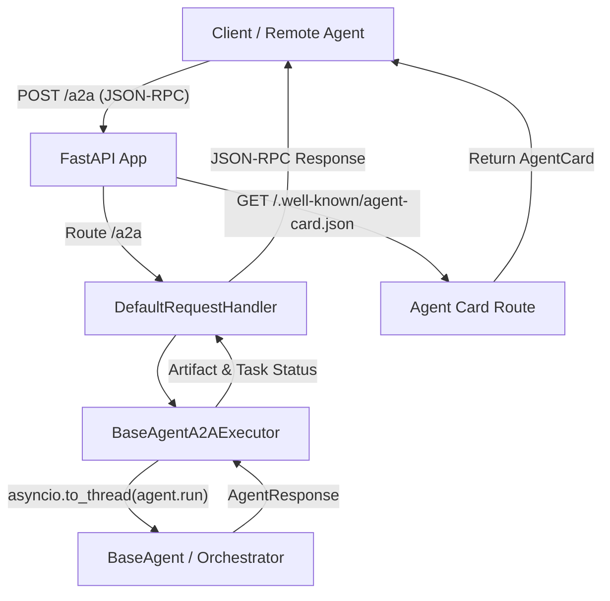
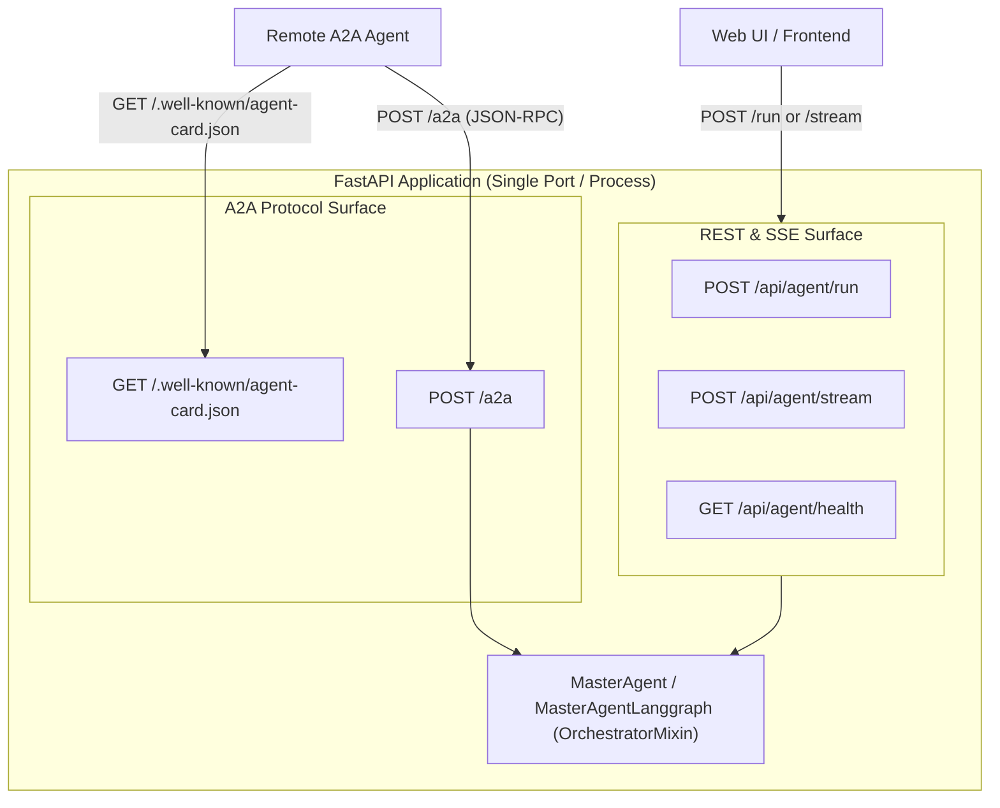

# A2A Implementation Guide

This document explains how the A2A (Agent-to-Agent) support in this project has been implemented, how it integrates with `BaseAgent`, and how to use it from both the server and client sides.

The implementation lives in [src/BasePackage/A2A.py](src/BasePackage/A2A.py) and is exported through [src/BasePackage/__init__.py](src/BasePackage/__init__.py).

## What A2A support provides

The package exposes a `BaseAgent` as an A2A-compatible service over FastAPI and JSON-RPC. In practical terms, this means:

- a concrete agent can publish an Agent Card describing its capabilities
- the agent can receive requests via the A2A JSON-RPC endpoint
- the request is converted into a call to the existing synchronous `BaseAgent.run()` method
- the result is packaged into an A2A task/artifact response
- another agent or client can call the service through a lightweight `A2AClient`

## High-level architecture



## Key components

### 1. `A2AAgentSkill`

This model describes a single capability exposed in the A2A Agent Card.

```python
class A2AAgentSkill(BaseModel):
    model_config = ConfigDict(extra="forbid")

    id: str = Field(..., min_length=1)
    name: str = Field(..., min_length=1)
    description: str = Field(..., min_length=1)
    tags: list[str] = Field(default_factory=list)
    examples: list[str] = Field(default_factory=list)
```

Why this exists:

- the card is not just metadata; it tells remote systems what the agent can do
- each skill includes a machine-friendly id and human-friendly metadata
- tags and examples make it easy for other agents to discover suitable capabilities

Example:

```python
A2AAgentSkill(
    id="echo",
    name="Echo text",
    description="Returns the supplied text.",
    tags=["text", "echo"],
    examples=["hello", "translate this sentence"],
)
```

### 2. `A2AAgentConfig`

This model holds the service metadata required to mount the A2A endpoint.

```python
class A2AAgentConfig(BaseModel):
    model_config = ConfigDict(extra="forbid")

    public_url: str = Field(..., min_length=1)
    rpc_path: str = "/a2a"
    version: str = "1.0.0"
    documentation_url: str | None = None
    input_modes: list[str] = Field(default_factory=lambda: ["text/plain"])
    output_modes: list[str] = Field(default_factory=lambda: ["text/plain"])
    skills: list[A2AAgentSkill] = Field(default_factory=list)

    def rpc_url(self) -> str:
        return f"{self.public_url.rstrip('/')}/{self.rpc_path.lstrip('/')}"
```

Important attributes:

- `public_url`: externally reachable base URL, such as `http://localhost:8000`
- `rpc_path`: A2A JSON-RPC path; default is `/a2a`
- `input_modes` / `output_modes`: declares supported content types
- `skills`: list of capabilities advertised to clients

This object is used both to build the Agent Card and to register the JSON-RPC route.

### 3. `build_agent_card(agent, config)`

This function converts a `BaseAgent` instance and config into the canonical A2A `AgentCard` payload.

```python
def build_agent_card(agent: BaseAgent, config: A2AAgentConfig) -> AgentCard:
    return AgentCard(
        name=agent.name,
        description=agent.description,
        version=config.version,
        documentation_url=config.documentation_url or "",
        supported_interfaces=[
            AgentInterface(
                url=config.rpc_url(),
                protocol_binding=TransportProtocol.JSONRPC,
                protocol_version=PROTOCOL_VERSION_1_0,
            )
        ],
        capabilities=AgentCapabilities(streaming=False),
        default_input_modes=config.input_modes,
        default_output_modes=config.output_modes,
        skills=[
            AgentSkill(
                id=skill.id,
                name=skill.name,
                description=skill.description,
                tags=skill.tags,
                examples=skill.examples,
                input_modes=config.input_modes,
                output_modes=config.output_modes,
            )
            for skill in config.skills
        ],
    )
```

This is important because remote clients often discover a service by calling the well-known agent card endpoint, not by hard-coding a service URL alone.

### 4. `mount_a2a_routes(app, agent, config)`

This is the service registration function that integrates the A2A implementation with a FastAPI application.

```python
def mount_a2a_routes(
    app: FastAPI,
    agent: BaseAgent,
    config: A2AAgentConfig,
) -> DefaultRequestHandler:
    agent_card = build_agent_card(agent, config)
    request_handler = DefaultRequestHandler(
        agent_executor=BaseAgentA2AExecutor(agent),
        task_store=InMemoryTaskStore(),
        agent_card=agent_card,
    )
    add_a2a_routes_to_fastapi(
        app,
        agent_card_routes=create_agent_card_routes(agent_card),
        jsonrpc_routes=create_jsonrpc_routes(request_handler, config.rpc_path),
    )
    return request_handler
```

This does three things:

1. creates the Agent Card
2. creates a request handler with an in-memory task store
3. attaches the agent-card and JSON-RPC routes to the existing FastAPI app

The typical endpoints become:

- `GET /.well-known/agent-card.json`
- `POST /a2a`

## Common Implementation: Automated A2A in Orchestrators (`create_api_app`)

While `mount_a2a_routes()` provides low-level, manual route mounting for any `BaseAgent`, the common pattern for deploying services in this framework is via `OrchestratorMixin.create_api_app()`.

All orchestrator classes (`MasterAgent`, `MasterAgentLanggraph`) inherit from `OrchestratorMixin`, and `create_api_app()` now provides **built-in, automatic A2A support enabled by default**.

### Method Signature

```python
def create_api_app(
    self,
    title: str | None = None,
    description: str | None = None,
    version: str = "1.0.0",
    prefix: str = "/api/agent",
    tags: list[str] | None = None,
    include_health: bool = True,
    enable_cors: bool = True,
    cors_options: dict[str, object] | None = None,
    enable_a2a: bool = True,
    a2a_public_url: str | None = None,
    a2a_skills: list[A2AAgentSkill] | None = None,
) -> FastAPI:
```

### How it Works

When `enable_a2a=True` (default):
1. **Public URL Resolution**: Resolves the agent's public URL from `a2a_public_url`, or the `AGENT_A2A_PUBLIC_URL` environment variable, falling back to `http://127.0.0.1:8000`.
2. **Skill Synthesis**: Automatically derives `A2AAgentSkill` from the orchestrator's `name`, `description`, and `config.tags` if custom skills are not provided.
3. **Route Mounting**: Calls `mount_a2a_routes(app, self, A2AAgentConfig(...))` automatically alongside REST (`POST /run`), streaming (`POST /stream`), and health (`GET /health`) routes.

### Architectural Unified Gateway Diagram



### Reasons Behind Doing So

1. **Zero-Boilerplate Service Publishing**
   - In multi-agent architectures, orchestrators are the primary entry points exposed as services.
   - Requiring developers to manually configure `A2AAgentConfig`, extract skills, and call `mount_a2a_routes()` on every application created unnecessary boilerplate and inconsistency across services.

2. **Unified API Gateway (Dual-Interface on a Single Port)**
   - Instead of managing separate server instances or ports for REST clients and A2A peer agents, a single FastAPI app seamlessly handles:
     - Standard REST requests (`/run`)
     - Real-time Server-Sent Events (`/stream`)
     - Health checks (`/health`)
     - A2A Agent Card discovery (`/.well-known/agent-card.json`)
     - A2A JSON-RPC execution (`/a2a`)

3. **Metadata Consistency & Single Source of Truth**
   - Automatically populates the `AgentCard` and `A2AAgentSkill` descriptors from the agent's existing metadata (`agent.name`, `agent.description`, `agent.config.tags`).
   - Prevents metadata drift between OpenAPI documentation and A2A service cards.

4. **Environment-Driven Configuration for Deployments**
   - In containerized and cloud environments (Docker, Kubernetes, reverse proxies), public hostnames and external ports vary across environments.
   - By reading `AGENT_A2A_PUBLIC_URL`, infrastructure configurations can set the advertised public endpoint without code changes.

5. **Configurability with Graceful Opt-Out**
   - While enabled by default to encourage agent interoperability, callers can pass custom skills via `a2a_skills` or disable A2A entirely with `enable_a2a=False` if only pure REST endpoints are desired.

## How requests are processed

### `BaseAgentA2AExecutor`

This class adapts the `BaseAgent.run()` contract to the A2A execution lifecycle.

```python
class BaseAgentA2AExecutor(AgentExecutor):
    def __init__(self, agent: BaseAgent) -> None:
        self._agent = agent
```

#### `execute(context, event_queue)`

This method is the actual bridge between the A2A protocol and the agent implementation.

```python
async def execute(self, context: RequestContext, event_queue: EventQueue) -> None:
    user_input = context.get_user_input().strip()
    if not user_input:
        raise ValueError("A2A messages must include non-empty text content.")
    if not context.task_id or not context.context_id:
        raise RuntimeError("A2A task and context identifiers are required.")

    updater = TaskUpdater(event_queue, context.task_id, context.context_id)
    await event_queue.enqueue_event(
        Task(
            id=context.task_id,
            context_id=context.context_id,
            status=TaskStatus(state=TaskState.TASK_STATE_SUBMITTED),
        )
    )
    await updater.start_work()

    try:
        response = await asyncio.to_thread(self._agent.run, user_input)
    except Exception:
        await updater.failed(
            updater.new_agent_message([Part(text="Agent execution failed.")])
        )
        return

    result_parts = [Part(text=response.content)]
    await updater.add_artifact(
        result_parts,
        name="agent-response",
        last_chunk=True,
    )
    await updater.complete(updater.new_agent_message(result_parts))
```

Detailed flow:

1. Read the incoming text input from the A2A request context.
2. Validate that the message is not empty.
3. Ensure both `task_id` and `context_id` exist.
4. Create a `TaskUpdater` bound to the event queue and context ids.
5. Emit a submitted task event.
6. Mark the task as started with `updater.start_work()`.
7. Run the user agent on a worker thread using `asyncio.to_thread(...)`.
   - this is important because `BaseAgent.run()` is synchronous in this project
8. If execution fails, emit a failed task state.
9. Otherwise, package the result as an A2A `Part(text=...)` artifact.
10. Add artifact and complete the task with a final agent message.

This is the critical adaptation layer. It lets a synchronous agent implementation behave correctly inside the async A2A server stack.

## Why `asyncio.to_thread` is used

`BaseAgent.run()` is designed as a synchronous method. The A2A server framework is inherently async. Using:

```python
response = await asyncio.to_thread(self._agent.run, user_input)
```

ensures the sync agent logic runs without blocking the event loop.

This is a good pattern when the underlying LLM or tool execution path is blocking but you need compatibility with async frameworks like FastAPI and A2A.

## Client side: `A2AClient`

The package also includes a convenience client class to invoke an A2A service from Python.

```python
class A2AClient:
    def __init__(self, service_url: str, *, timeout_seconds: float = 30.0) -> None:
        self._service_url = service_url.rstrip("/")
        self._timeout_seconds = timeout_seconds
```

### `invoke(user_input)`

```python
async def invoke(self, user_input: str) -> str:
    text = user_input.strip()
    if not text:
        raise ValueError("A2A input must not be empty.")

    httpx_client = httpx.AsyncClient(timeout=self._timeout_seconds)
    client = None
    try:
        client = await create_client(
            self._service_url,
            client_config=ClientConfig(
                streaming=False,
                httpx_client=httpx_client,
                supported_protocol_bindings=[TransportProtocol.JSONRPC],
            ),
        )
        request = SendMessageRequest(
            message=new_text_message(text, role=Role.ROLE_USER)
        )
        async for response in client.send_message(request):
            if response.HasField("message"):
                output = get_message_text(response.message).strip()
                if output:
                    return output
            if response.HasField("task"):
                task = response.task
                if task.status.state == TaskState.TASK_STATE_FAILED:
                    raise A2AClientError("Remote A2A agent reported a failed task.")
                output = "\n".join(
                    get_artifact_text(artifact).strip()
                    for artifact in task.artifacts
                ).strip()
                if output:
                    return output
                raise A2AClientError("Remote A2A agent returned no text artifact.")
        raise A2AClientError("Remote A2A agent returned no response.")
    except (SDKClientError, httpx.HTTPError, ValueError) as exc:
        raise A2AClientError(f"A2A request failed: {exc}") from exc
    finally:
        if client is not None:
            await client.close()
        else:
            await httpx_client.aclose()
```

What it does:

- creates an async HTTP client for the A2A service
- packages the input as a `SendMessageRequest`
- iterates over the returned A2A protocol events
- prefers text from the response message if present
- otherwise reads text from task artifacts
- raises `A2AClientError` for failures or empty responses

### Sync wrapper: `invoke_sync`

Because many existing call sites are synchronous, the class also provides:

```python
def invoke_sync(self, user_input: str) -> str:
    try:
        asyncio.get_running_loop()
    except RuntimeError:
        return asyncio.run(self.invoke(user_input))
    raise RuntimeError("invoke_sync cannot run inside an active event loop; use await invoke(...).")
```

This is useful when calling from a tool, script, or synchronous LangChain function.

## Example 1: Exposing an Orchestrator via `create_api_app` (Common Pattern)

For orchestrators (`MasterAgent`, `MasterAgentLanggraph`), A2A routes and the Agent Card are mounted automatically when calling `create_api_app()`.

```python
from BasePackage import AgentConfig, MasterAgent, BaseAgent


class AnalysisAgent(MasterAgent):
    def setup_child_agents(self) -> None:
        # Register specialist child agents here
        pass


agent = AnalysisAgent(
    AgentConfig(
        name="analysis-master",
        description="Master orchestrator for multi-agent data analysis.",
        tags=["analysis", "orchestrator"],
    )
)

# A2A is enabled by default with public URL fallback to http://127.0.0.1:8000
# or via AGENT_A2A_PUBLIC_URL env variable
app = agent.create_api_app(
    prefix="/api/analysis",
    a2a_public_url="https://api.myorg.com",
)
```

This single app exposes:
- `POST /api/analysis/run` (REST synchronous execution)
- `POST /api/analysis/stream` (SSE real-time streaming execution)
- `GET /api/analysis/health` (Health check)
- `GET /.well-known/agent-card.json` (A2A Agent Card discovery)
- `POST /a2a` (A2A JSON-RPC interface)

## Example 2: Exposing a Standalone `BaseAgent` Manually

If you have a standalone `BaseAgent` and want to mount A2A routes manually onto an existing FastAPI app:

```python
from fastapi import FastAPI

from BasePackage import (
    AgentConfig,
    AgentResponse,
    BaseAgent,
    A2AAgentConfig,
    A2AAgentSkill,
    mount_a2a_routes,
)


class EchoAgent(BaseAgent):
    def build_tools(self) -> list:
        return []

    def build_system_prompt(self) -> str:
        return "Return the supplied text as-is."

    def run(self, user_input: str) -> AgentResponse:
        return AgentResponse(content=f"Echo: {user_input}")


app = FastAPI()
agent = EchoAgent(
    AgentConfig(
        name="echo-agent",
        description="Returns supplied text.",
    )
)

mount_a2a_routes(
    app,
    agent,
    A2AAgentConfig(
        public_url="http://localhost:8000",
        skills=[
            A2AAgentSkill(
                id="echo",
                name="Echo text",
                description="Returns the supplied text.",
            )
        ],
    ),
)
```

Once mounted, the app exposes:

- `/.well-known/agent-card.json` for card discovery
- `/a2a` for the JSON-RPC message endpoint

## Example: remote call from another service

```python
import asyncio
from BasePackage import A2AClient


async def main() -> None:
    client = A2AClient("http://localhost:8000")
    response = await client.invoke("hello from another service")
    print(response)


asyncio.run(main())
```

Expected output-like behavior:

```text
Echo: hello from another service
```

## Example: JSON-RPC request payload

A typical request sent to `/a2a` looks like this:

```json
{
  "jsonrpc": "2.0",
  "id": "request-1",
  "method": "SendMessage",
  "params": {
    "message": {
      "messageId": "message-1",
      "role": "ROLE_USER",
      "parts": [{"text": "hello"}]
    }
  }
}
```

A typical successful response shape is:

```json
{
  "jsonrpc": "2.0",
  "id": "request-1",
  "result": {
    "task": {
      "id": "task-id",
      "contextId": "context-id",
      "status": {
        "state": "TASK_STATE_COMPLETED"
      },
      "artifacts": [
        {
          "parts": [{"text": "Echo: hello"}]
        }
      ]
    }
  }
}
```

## How this works with `BaseAgent`

The package is intentionally designed to integrate with agents that already follow the project’s `BaseAgent` contract.

This means the A2A layer does not force a new agent framework; instead, it wraps an existing synchronous `run(user_input)` model into A2A task semantics.

The `BaseAgent` contract is effectively treated as the business logic layer, while `A2A.py` acts as the protocol adaptation layer.

## Error handling pattern

The implementation includes explicit checks for common protocol problems:

- empty message input -> `ValueError`
- missing task or context IDs -> `RuntimeError`
- remote task failed -> `A2AClientError`
- remote agent returns no text -> `A2AClientError`
- HTTP / SDK request failure -> `A2AClientError`

This makes failures visible and easy to debug without silently swallowing problems.

## Summary

The A2A implementation is a thin but complete adapter layer that:

- exposes `BaseAgent` instances as A2A-compatible services
- publishes machine-readable skill metadata via Agent Card generation
- forwards JSON-RPC message requests into `BaseAgent.run()`
- tracks task submission, execution, and completion through the A2A task lifecycle
- allows any Python client to call that service using a minimal `A2AClient`

In short, the design keeps the agent logic reusable while translating it into the A2A protocol without requiring a rewrite of the core agent framework.
