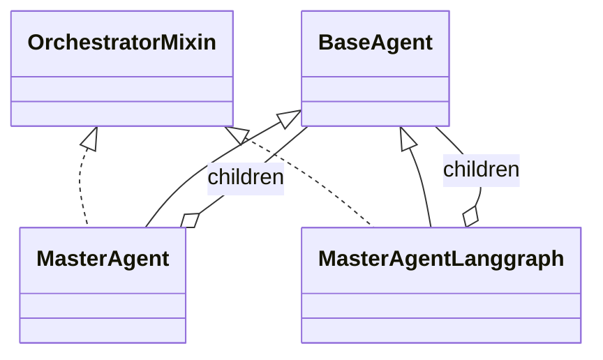

# BasePackage Class Reference

This document gives a high-level view of the core classes in BasePackage.
It focuses on the shared agent foundation and orchestration layers only.

It intentionally excludes domain-specific consumer implementations so the focus stays on the reusable package foundation.

## Class Diagram

Diagram legend:

- Solid line with a hollow arrow head, such as `BaseAgent <|-- MasterAgent`, means inheritance or generalization. In this document, `MasterAgent` and `MasterAgentLanggraph` inherit from `BaseAgent`, and both orchestrator classes also implement the `OrchestratorMixin` contract.
- Solid line with a diamond, such as `MasterAgent o-- BaseAgent : children`, means aggregation or ownership. Here it shows that each orchestrator manages a set of child agents.
- The dotted line style is not used in this diagram. In Mermaid class diagrams, dotted relationships are usually used for dependency or implementation-style links, but this document keeps the notation to solid inheritance and aggregation links for clarity.

## Quick View

| Class | Role | Kind |
|---|---|---|
| BaseAgent | LangChain-backed single-agent scaffold | Abstract base class |
| OrchestratorMixin | Shared orchestration contract and helpers | Abstract mixin |
| MasterAgent | Sequential multi-agent orchestrator | Concrete orchestrator |
| MasterAgentLanggraph | Graph-based multi-agent orchestrator | Concrete orchestrator |

## BaseAgent

Purpose:
Provides the reusable agent scaffold for LangChain-based chat agents.

| Properties | Purpose |
|---|---|
| config | External configuration object |
| tools | Tool list bound to the model |
| memory | Mutable runtime memory store |
| chat_history | Message history for the conversation |
| _model | Internal model reference |
| chain | Runnable prompt-plus-model pipeline |

| Methods | Purpose |
|---|---|
| initialize() | Builds tools, model, memory, and chain |
| run(user_input) | Executes one agent turn |
| build_tools() | Abstract hook for tool registration |
| build_system_prompt() | Abstract hook for system prompt text |
| build_prompt() | Creates the default prompt template |
| build_chain() | Connects prompt and model into a runnable |
| generate_response(messages) | Produces the model response and metadata |
| parse_user_input(user_input) | Converts raw input into AgentMessage |
| add_message(message) | Appends a message to chat history |
| reset_history() | Clears chat history |

| Usage | Typical use |
|---|---|
| Subclassing base | Extend for a single specialized agent |
| Direct execution | Rare; usually invoked through a subclass |

## OrchestratorMixin

Purpose:
Defines the shared orchestration contract and routing helpers for multi-agent systems.

| Properties | Purpose |
|---|---|
| children | Registry of child agents keyed by name |
| routing_keywords | Keyword map used for keyword routing |
| default_child | Fallback child when no match is found |
| routing_mode | Current routing strategy, keyword or llm |
| enable_react_evaluation | Toggle for evaluate/refine behavior |

| Methods | Purpose |
|---|---|
| setup_child_agents() | Abstract hook for registering child agents |
| add_child(...) | Registers one child agent |
| build_tools() | Shared default returns an empty tool list |
| build_system_prompt() | Shared default orchestration prompt |
| _build_execution_plan(user_input) | Builds a plan for the request |
| _build_keyword_execution_plan(...) | Builds a keyword-based plan |
| _build_llm_execution_plan(user_input) | Asks the model to build a plan |
| _select_children_keyword(user_input) | Keyword routing implementation |
| _fallback_children() | Chooses the default child or first child |
| _compose_step_input(task, child_outputs) | Adds prior outputs as context |
| _compose_final_response(...) | Builds the final combined response |
| _evaluate_child_response(...) | Scores one child response |
| _evaluate_final_response(...) | Scores the final combined response |
| _parse_json_response(raw_content) | Extracts JSON from model output |
| _validate_execution_plan(parsed_plan) | Checks LLM-generated plans |

| Usage | Typical use |
|---|---|
| Shared base for orchestrators | Mixed into sequential and graph orchestrators |

## MasterAgent

Purpose:
Implements sequential orchestration on top of the shared mixin.

| Properties | Purpose |
|---|---|
| _children | Child agent registry |
| _routing_keywords | Routing keyword mapping |
| default_child | Fallback child name |
| _routing_mode | Routing strategy |
| _last_routing_metadata | Metadata about the routing decision |
| _iteration_counts | Per-child refinement counter |
| _enable_react_evaluation | Switch for ReAct-style evaluation |

| Methods | Purpose |
|---|---|
| initialize() | Initializes self and all children |
| run(user_input) | Main sequential entry point |
| _run_with_react_evaluation(user_input) | Sequential execution with evaluation and refinement |
| _run_without_react_evaluation(user_input) | Sequential execution without refinement |
| _select_children(user_input) | Chooses keyword or LLM routing path |
| _select_children_llm(user_input) | LLM-based child selection |
| _validate_selected_children(selected_children) | Filters invalid child names |
| _execute_and_refine_child(...) | Executes a child and optionally refines it |
| _refine_child_response(...) | Asks a child to improve its answer |

| Usage | Typical use |
|---|---|
| Sequential orchestration | Use when workflow should run in order |
| ReAct toggle | Use when child outputs may need iterative improvement |

## MasterAgentLanggraph

Purpose:
Implements orchestration as a LangGraph workflow instead of a direct sequential loop.

| Properties | Purpose |
|---|---|
| _children | Child agent registry |
| _routing_keywords | Routing keyword mapping |
| default_child | Fallback child name |
| _routing_mode | Routing strategy |
| _last_routing_metadata | Metadata about the routing decision |
| _enable_react_evaluation | Switch for ReAct-style evaluation |
| _graph | Compiled LangGraph workflow |

| Methods | Purpose |
|---|---|
| initialize() | Initializes children and builds the graph |
| _build_graph() | Creates and compiles the workflow graph |
| run(user_input) | Executes the graph and returns the final response |
| _node_plan(state) | Plans the execution steps |
| _node_execute(state) | Runs the planned children |
| _node_evaluate(state) | Evaluates outputs and final response |
| _node_refine(state) | Re-runs children that need improvement |
| _node_finalize(state) | Ensures the final response is ready |
| _should_evaluate(state) | Decides whether to evaluate |
| _should_refine(state) | Decides whether to refine |
| _should_evaluate_after_refine(state) | Decides whether to loop back |
| get_graph_mermaid() | Returns Mermaid diagram text |
| get_graph_ascii() | Returns ASCII diagram text |
| visualize_workflow() | Prints the workflow visualization |

| Usage | Typical use |
|---|---|
| Graph orchestration | Use when workflow visibility and graph control matter |
| Visualization | Useful for inspecting orchestration flow |

## Practical Relationships

- BaseAgent is the root execution scaffold for all concrete agents.
- OrchestratorMixin adds the shared multi-agent contract and helper logic.
- MasterAgent and MasterAgentLanggraph are the two orchestration implementations.

## Related Files

- [BaseAgent.md](./BaseAgent.md)
- [OrchestratorMixin.md](./OrchestratorMixin.md)
- [MasterAgent.md](./MasterAgent.md)
- [MasterAgentLanggraph.md](./MasterAgentLanggraph.md)