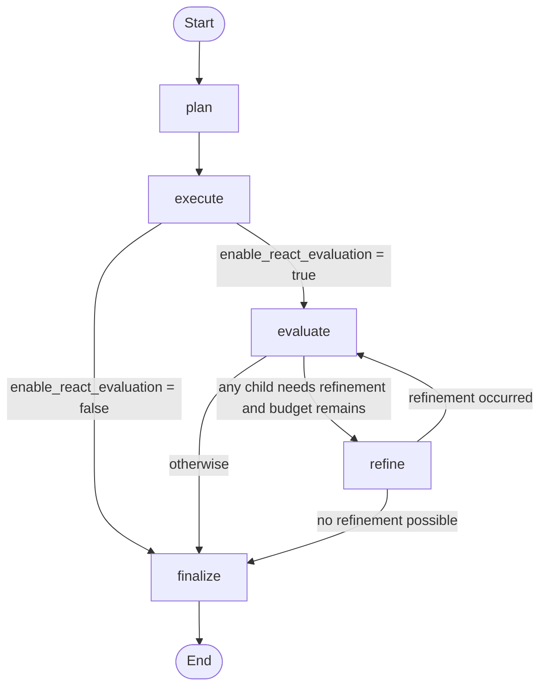

# MasterAgentLanggraph: Graph-Based Orchestration

This document describes graph-specific behavior in BasePackage/MasterAgentLanggraph.py.

Shared orchestration implementations (properties, child registration, planning/routing defaults, composition, evaluation helpers) are defined in [OrchestratorMixin.md](./OrchestratorMixin.md) and intentionally omitted here.

---

## Overview

MasterAgentLanggraph is the LangGraph-based execution implementation.

- Inherits: MasterAgentLanggraph(OrchestratorMixin, BaseAgent)
- Uses shared orchestration defaults from OrchestratorMixin
- Adds graph construction, graph node handlers, and conditional transitions
- Emits orchestration progress events consumed by the shared SSE stream endpoint

---

## Graph Workflow

The orchestrator compiles a StateGraph with these nodes:

- plan
- execute
- evaluate
- refine
- finalize



Conditional transitions:

- execute -> evaluate when enable_react_evaluation is True
- execute -> finalize when enable_react_evaluation is False
- evaluate -> refine when at least one child needs refinement and iteration budget remains
- evaluate -> finalize otherwise
- refine -> evaluate when a refinement occurred
- refine -> finalize when no further refinement is possible

---

## Node Responsibilities

- _node_plan
  - Builds execution plan using shared mixin planning helpers.
  - Stores selected children and routing metadata into graph state.
  - Emits plan event with summary and step metadata.

- _node_execute
  - Executes child agents in planned order.
  - Applies prior outputs when use_previous_outputs is set.
  - Stores child outputs, metadata, and iteration counts.
  - Emits step_started and step_completed events per step.

- _node_evaluate
  - Uses shared mixin evaluation helpers for each child output.
  - Builds and evaluates final composed response.
  - Emits step_evaluated and final_evaluated events.

- _node_refine
  - Re-runs only children that need refinement.
  - Injects feedback into refine prompts.
  - Resets evaluation state for re-assessment in next evaluate pass.
  - Emits step_refined for each refined step.

- _node_finalize
  - Ensures final response text is composed before returning.
  - Emits finalizing event.

---

## Streaming Endpoint Behavior

MasterAgentLanggraph does not define HTTP routes directly. It relies on OrchestratorMixin.create_api_router(), which exposes:

- POST /run
- POST /stream
- GET /health (optional)

When a concrete orchestrator creates an API app with a custom prefix, the stream endpoint follows that prefix. For example, with `create_api_app(prefix="/api/mastergraph")`, the route is:

- POST /api/mastergraph/stream

The exact endpoint name is determined by the app wrapper, not by a fixed repository-specific route.

The request body is OrchestratorAPIRequest with these fields:

- input (required, non-empty string)
- routing_mode (optional: keyword or llm)
- enable_react_evaluation (optional bool)
- reset_history (optional bool, default true)

The response media type is text/event-stream.

---

## Stream Event Sequence and Payloads

Baseline SSE events from the mixin wrapper:

- connected: emitted immediately with UTC timestamp.
- keepalive: emitted periodically while worker output is pending.
- final: full OrchestratorAPIResponse payload.
- done: terminal event with success boolean.
- error: terminal error payload with status_code and detail.

Graph progress events emitted by MasterAgentLanggraph:

- plan: execution-plan summary and ordered step list.
- step_started: step_key, child, and order.
- step_completed: step_key, child, order, and output_preview.
- step_evaluated: step_key, quality_score, and needs_refinement.
- step_refined: step_key, child, and iteration.
- final_evaluated: quality_score and coherence flag.
- finalizing: emitted when final response assembly completes.

Token events:

- token events can be emitted during final synthesis when model streaming is available.
- if no token events were produced by the agent callback, the mixin synthesizes token events from the final content (split by whitespace) before emitting final.

Typical ordering:

1. connected
2. plan
3. step_started / step_completed pairs
4. optional evaluation and refinement events
5. optional token events
6. final
7. done

---

## Conditional Helpers

- _should_evaluate
- _should_refine
- _should_evaluate_after_refine

These control graph edge decisions using state values and MAX_ITERATIONS_PER_CHILD.

---

## Execution Entrypoint

- run(user_input: str) -> AgentResponse

Behavior:
- Lazily initializes and compiles graph if needed.
- Creates initial OrchestrationState.
- Invokes compiled graph.
- Returns AgentResponse with orchestration metadata.

---

## Constants

- MAX_ITERATIONS_PER_CHILD = 2
- CONFIDENCE_THRESHOLD = 0.75

These are used by graph refinement decisioning and shared evaluation helpers from OrchestratorMixin.

---

## Visualization Helpers

- get_graph_mermaid()
- get_graph_ascii()
- visualize_workflow()

These are graph-only utilities and remain specific to MasterAgentLanggraph.

---

## Initialization State

MasterAgentLanggraph __init__ initializes the required shared state expected by OrchestratorMixin plus graph state:

- _children
- _routing_keywords
- default_child
- _routing_mode
- _last_routing_metadata
- _enable_react_evaluation
- _graph

---

## Important Notes

- Shared routing/planning/evaluation logic is not implemented here anymore; it is inherited from OrchestratorMixin.
- execute node currently runs planned children in sequence.
- setup_child_agents remains abstract at mixin level; domain-specific subclasses should implement it.

---

## Sample Orchestration Code

```python
from BasePackage.AgentConfig import AgentConfig
from BasePackage.BaseAgent import BaseAgent
from BasePackage.MasterAgentLanggraph import MasterAgentLanggraph


class EchoChildAgent(BaseAgent):
    def build_tools(self):
        return []

    def build_system_prompt(self) -> str:
        return "You are a focused helper for one orchestration step."


class DemoGraphOrchestrator(MasterAgentLanggraph):
    def setup_child_agents(self) -> None:
        analyzer = EchoChildAgent(
            AgentConfig(name="analyzer", description="Analyze the request")
        )
        planner = EchoChildAgent(
            AgentConfig(name="planner", description="Create an action plan")
        )

        self.children = {
            "analyzer": analyzer,
            "planner": planner,
        }
        self.routing_keywords = {
            "analyzer": ["analyze", "diagnose", "root cause"],
            "planner": ["plan", "steps", "solution"],
        }
        self.default_child = "analyzer"


config = AgentConfig(
    name="demo-graph-master",
    description="Graph orchestration demo",
)

agent = DemoGraphOrchestrator(config)
agent.setup_child_agents()
agent.routing_mode = "keyword"  # or "llm"
agent.enable_react_evaluation = True
agent.initialize()  # Builds and compiles the LangGraph

print(agent.get_graph_mermaid())

response = agent.run("Analyze the incident and provide a recovery plan")
print(response.content)
print(response.metadata["orchestration"]["execution_plan"])
```

What this demonstrates:

- Subclassing MasterAgentLanggraph and implementing setup_child_agents().
- Building a graph-driven orchestrator with the same routing configuration model.
- Initializing, visualizing, and executing the graph workflow.

---

## Related Docs

- [OrchestratorMixin.md](./OrchestratorMixin.md)
- [MasterAgent.md](./MasterAgent.md)
- [REACT_TOGGLE_GUIDE.md](./REACT_TOGGLE_GUIDE.md)
